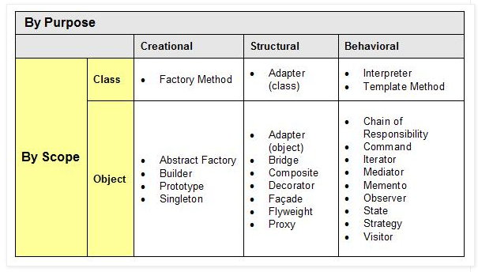
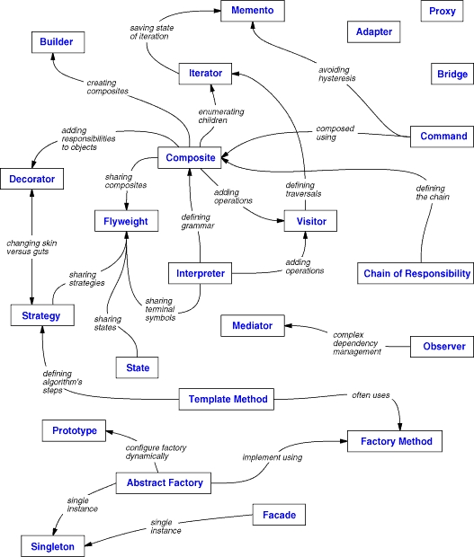
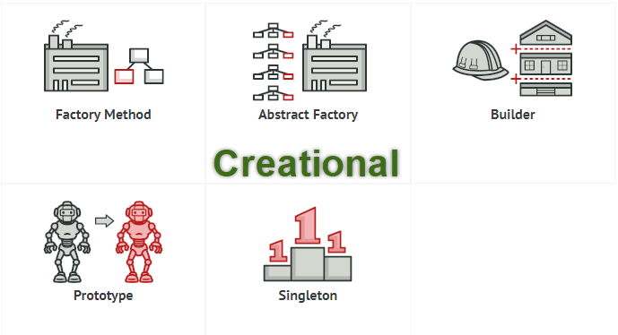

# design-patterns

Design Patterns (mẫu thiết kế) là một kỹ thuật trong lập trình, cung cấp cho bạn các “mẫu thiết kế”, giải quyết vấn đề một cách tối ưu nhất các vấn đề chung, thường gặp trong lập trình.

## Design Patterns

Design Pattern chủ yếu được dựa theo những quy tắc sau đây về thiết kế hướng đối tượng.

[Lập trình cho interface chứ không phải để implement interface đó](https://stackoverflow.com/questions/2697783/what-does-program-to-interfaces-not-implementations-mean)\
[Ưu tiên object composition (chứa trong) hơn là inheritance (thừa kế)](https://stackoverflow.com/questions/49002/prefer-composition-over-inheritance)

- Creational Pattern (nhóm khởi tạo – 5 mẫu) gồm: Factory Method, Abstract Factory, Builder, Prototype, Singleton.\
Những Design pattern loại này cung cấp một giải pháp để tạo ra các object và che giấu được logic của việc tạo ra nó, thay vì tạo ra object một cách trực tiếp bằng cách sử dụng method new. Điều này giúp cho chương trình trở nên mềm dẻo hơn trong việc quyết định object nào cần được tạo ra trong những tình huống được đưa ra.

- Structural Pattern (nhóm cấu trúc – 7 mẫu) gồm: Adapter, Bridge, Composite, Decorator, Facade, Flyweight và Proxy.\
Những Design pattern loại này liên quan tới class và các thành phần của object. Nó dùng để thiết lập, định nghĩa quan hệ giữa các đối tượng.

- Behavioral Pattern (nhóm tương tác/ hành vi – 11 mẫu) gồm: Interpreter, Template Method, Chain of Responsibility, Command, Iterator, Mediator, Memento, Observer, State, Strategy và Visitor.\
Nhóm này dùng trong thực hiện các hành vi của đối tượng, sự giao tiếp giữa các object với nhau.

### Nhóm Creational (nhóm khởi tạo)

- Singleton:\
Đảm bảo 1 class chỉ có 1 instance và cung cấp 1 điểm truy xuất toàn cục đến nó.
Tần suất sử dụng: cao trung bình.

- Abstract Factory:\
Cung cấp một interface cho việc tạo lập các đối tượng (có liên hệ với nhau) mà không cần qui định lớp khi hay xác định lớp cụ thể (concrete) tạo mỗi đối tượng.
Tần suất sử dụng: cao.

- Factory Method:\
Định nghĩa Interface để sinh ra đối tượng nhưng để cho lớp con quyết định lớp nào được dùng để sinh ra đối tượng Factory method cho phép một lớp chuyển quá trình khởi tạo đối tượng cho lớp con.
Tần suất sử dụng: cao.

- Builder:\
Tách rời việc xây dựng (construction) một đối tượng phức tạp khỏi biểu diễn của nó sao cho cùng một tiến trình xây dựng có thể tạo được các biểu diễn khác nhau.
Tần suất sử dụng: trung bình thấp.

- Prototype:\
Qui định loại của các đối tượng cần tạo bằng cách dùng một đối tượng mẫu, tạo mới nhờ vào sao chép đối tượng mẫu này.
Tần suất sử dụng: trung bình.

### Nhóm Structural (nhóm cấu trúc)

- Adapter:\
Do vấn đề tương thích, thay đổi interface của một lớp thành một interface khác phù hợp với yêu cầu người sử dụng lớp.
Tần suất sử dụng: cao trung bình.

- Bridge:\
Tách rời ngữ nghĩa của một vấn đề khỏi việc cài đặt, mục đích để cả hai bộ phận (ngữ nghĩa và cài đặt) có thể thay đổi độc lập nhau.
Tần suất sử dụng: trung bình.

- Composite:\
Tổ chức các đối tượng theo cấu trúc phân cấp dạng cây. Tất cả các đối tượng trong cấu trúc được thao tác theo một cách thuần nhất như nhau.
Tạo quan hệ thứ bậc bao gộp giữa các đối tượng. Client có thể xem đối tượng bao gộp và bị bao gộp như nhau -> khả năng tổng quát hoá trong code của client -> dễ phát triển, nâng cấp, bảo trì.
Tần suất sử dụng: cao trung bình.

- Decorator:\
Gán thêm trách nhiệm cho đối tượng (mở rộng chức năng) vào lúc chạy (dynamically).
Tần suất sử dụng:trung bình.

- Facade:\
Cung cấp một interface thuần nhất cho một tập hợp các interface trong một “hệ thống con” (subsystem). Nó định nghĩa 1 interface cao hơn các interface có sẵn để làm cho hệ thống con dễ sử dụng hơn.
Tần suất sử dụng: cao.

- Flyweight:\
Sử dụng việc chia sẻ để thao tác hiệu quả trên một số lượng lớn đối tượng “cở nhỏ” (chẳng hạn paragraph, dòng, cột, ký tự…).
Tần suất sử dụng: thấp.

- Proxy:\
Cung cấp đối tượng đại diện cho một đối tượng khác để hỗ trợ hoặc kiểm soát quá trình truy xuất đối tượng đó. Đối tượng thay thế gọi là proxy.
Tần suất sử dụng: cao trung bình.

### Nhóm Behavioral (nhóm hành vi/ tương tác)

- Chain of Responsibility:\
Khắc phục việc ghép cặp giữa bộ gởi và bộ nhận thông điệp. Các đối tượng nhận thông điệp được kết nối thành một chuỗi và thông điệp được chuyển dọc theo chuỗi nầy đến khi gặp được đối tượng xử lý nó. Tránh việc gắn kết cứng giữa phần tử gởi request với phần tử nhận và xử lý request bằng cách cho phép hơn 1 đối tượng có có cơ hội xử lý request. Liên kết các đối tượng nhận request thành 1 dây chuyền rồi gửi request xuyên qua từng đối tượng xử lý đến khi gặp đối tượng xử lý cụ thể.
Tần suất sử dụng: trung bình thấp.

- Command:\
Mỗi yêu cầu (thực hiện một thao tác nào đó) được bao bọc thành một đối tượng. Các yêu cầu sẽ được lưu trữ và gởi đi như các đối tượng.Đóng gói request vào trong một Object, nhờ đó có thể nthông số hoá chương trình nhận request và thực hiện các thao tác trên request: sắp xếp, log, undo…
Tần suất sử dụng: cao trung bình.

- Interpreter:\
Hỗ trợ việc định nghĩa biểu diễn văn phạm và bộ thông dịch cho một ngôn ngữ.
Tần suất sử dụng: thấp.

- Iterator:\
Truy xuất các phần tử của đối tượng dạng tập hợp tuần tự (list, array, …) mà không phụ thuộc vào biểu diễn bên trong của các phần tử.
Tần suất sử dụng: cao.

- Mediator:\
Định nghĩa một đối tượng để bao bọc việc giao tiếp giữa một số đối tượng với nhau.
Tần suất sử dụng: trung bình thấp.

- Memento:\
Hiệu chỉnh và trả lại như cũ trạng thái bên trong của đối tượng mà vẫn không vi phạm việc bao bọc dữ liệu.
Tần suất sử dụng: thấp.

- Observer:\
Định nghĩa sự phụ thuộc một-nhiều giữa các đối tượng sao cho khi một đối tượng thay đổi trạng thái thì tất cả các đối tượng phụ thuộc nó cũng thay đổi theo.
Tần suất sử dụng: cao.

- State:\
Cho phép một đối tượng thay đổi hành vi khi trạng thái bên trong của nó thay đổi, ta có cảm giác như class của đối tượng bị thay đổi.
Tần suất sử dụng: trung bình.

- Strategy:\
Bao bọc một họ các thuật toán bằng các lớp đối tượng để thuật toán có thể thay đổi độc lập đối với chương trình sử dụng thuật toán.Cung cấp một họ giải thuật cho phép client chọn lựa linh động một giải thuật cụ thể khi sử dụng.
Tần suất sử dụng: cao trung bình.

- Template method:\
Định nghĩa phần khung của một thuật toán, tức là một thuật toán tổng quát gọi đến một số phương thức chưa được cài đặt trong lớp cơ sở; việc cài đặt các phương thức được ủy nhiệm cho các lớp kế thừa.
Tần suất sử dụng: trung bình.

- Visitor:\
Cho phép định nghĩa thêm phép toán mới tác động lên các phần tử của một cấu trúc đối tượng mà không cần thay đổi các lớp định nghĩa cấu trúc đó.
Tần suất sử dụng: thấp.

## Thanks

[refactoring.guru](https://refactoring.guru/design-patterns)

[sourcemaking](https://sourcemaking.com/design_patterns)

[java-design-patterns](https://java-design-patterns.com/)

[oodesign](https://www.oodesign.com/)

[tutorialspoint](https://www.tutorialspoint.com/design_pattern/index.htm)

[javatpoint](https://www.javatpoint.com/design-patterns-in-java)

[javacamp](http://www.javacamp.org/designPattern/)

[wikipedia](https://en.wikipedia.org/wiki/Software_design_pattern)

[baeldung](https://www.baeldung.com/tag/pattern/)

[gpcoder](https://gpcoder.com/category/design-pattern/)

[stackjava](https://stackjava.com/category/design-pattern)
